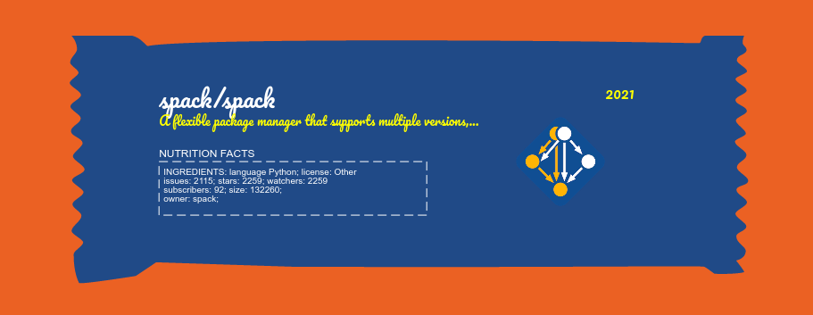

# Candy Generator

Welcome to the Candy Generator! This is a tool that will allow you to create
and save your own repository candy, to truly celebrate an Open Source Halloween! 

Instructions:

 1. Go to the [interface](https://vsoch.github.io/candy-generator/)
 2. Load your repository by entering the name "org/name" under "Load A GitHub Repository"
 3. Customize the candy form, texture, and colors!
 4. Save a screenshot and add to your Halloween basket!

⭐️ [Browse to the interface!](https://vsoch.github.io/candy-generator/) ⭐️

I think it would be cool to have a standard filename to add to a repository to indicate
that a user can go trick or treating there, and then be easily able to load an entire interface
of these images. This would be easier with:

1. Adding a save to png button
2. Creating an interface that can easily find and render the PNGs
3. Possibly having an action that can generate a candy automatically

However, I think I like the candies better when the repository owner designs on their own, so
I'm not sure if the above is overkill.

## Frequently Asked Questions

### How does it work?

Overall, the idea is that we are putting together puzzle pieces. We have candy form bases (e.g., an outline of a candy bar)
that we can add to an svg, and then further customize by adding text, textures, and color. 

### How did I make the candy backgrounds?

This was a manual process! I started with a png of a candy that I wanted to use, and then:

1. In Inkscape used trace bitmap with 8 colors to get to a bottom, solid layer
2. Added an extra layer of the same color (usually a large rectangle) and combined with the lower to fill in gaps.
3. Saved to an svg file, stored in [assets/candy](assets/candy)
4. Copied the paths, style, and other attributes into the [assets/js/candy.json](assets/js/candy.json)

Getting the text to line up was a big of an art! I tested each background to make a custom scale
and then x and y offset for the main text.

## Thanks

The Candy Generator would not be possible without these amazing supporting libraries!

- [textures](https://riccardoscalco.it/textures/): to make your candy wrapper textures!
- [d3](https://d3js.org/): for easily mapping data to svg objects
- [jquery](https://jquery.com/): because you can make a million new trendy JS libraries but this one always is easy-peezy
